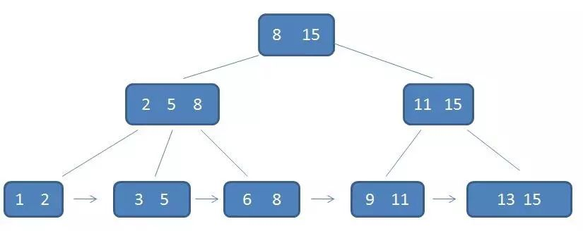
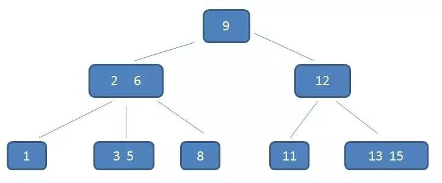

# Mysql索引总结

## 索引模型

1. 哈希表
   适用于只有等值查询的场景。不支持**最左匹配规则**，没办法利用索引完成**排序**，无法进行**范围查询**。如果有大量重复键值的情况下，存在哈希碰撞问题

2. 有序数组
   有序数组索引只适用于静态存储引擎。查询效率高，但更新数据成本高。

3. 搜索树

   二叉树是搜索效率最高的，但是实际上大多数的数据库存储却并不使用二叉树。其原因是，索引不止存在内存中，还要写到磁盘上。

   > 一棵 100 万节点的平衡二叉树，树高 20。一次查询可能需要访问 20 个数据块。在机械硬盘时代，从磁盘随机读一个数据块需要 10 ms 左右的寻址时间。也就是说，对于一个 100 万行的表，如果使用二叉树来存储，单独访问一个行可能需要 20 个 10 ms 的时间

为了让一个查询尽量少地读磁盘，就必须让查询过程访问尽量少的数据块。使用“N 叉”树。N设置多少合适？不管内存还是磁盘，操作系统都是按页读取(4KB，innodb页大小默认16kb)。如果读取数据量超过一页会触发多次IO。所以选择N时**尽量让每个节点大小等于页大小**，读取一个节点只需要一次磁盘IO。

> 以 InnoDB 的一个整数字段索引为例，这个 N 差不多是 1200。这棵树高是 4 的时候，就可以存 1200 的 3 次方个值，这已经 17 亿了。考虑到树根的数据块总是在内存中的，一个 10 亿行的表上一个整数字段的索引，查找一个值最多只需要访问 3 次磁盘。其实，树的第二层也有很大概率在内存中，那么访问磁盘的平均次数就更少了。

在 InnoDB 中，表都是根据主键顺序以索引的形式存放的，这种存储方式的表称为索引组织表。又因为前面我们提到的，InnoDB 使用了 B+ 树索引模型，所以数据都是存储在 B+ 树中的。
每一个索引在 InnoDB 里面对应一棵 B+ 树。

根据叶子节点的内容，索引类型分为主键索引和非主键索引。

- 主键索引的叶子节点存的是整行数据，也被称为聚簇索引。
- 非主键索引的叶子节点内容是主键的值，非主键索引也被称为二级索引。

基于非主键索引的查询需要多扫描一棵索引树。

## B+树介绍

1. 节点中子节点个数不超过m，不小于m/2，（根节点子节点个数可以小于m/2，例外）
2. 通过双向链表将叶子节点串联。

**一个m阶的B+树具有如下几个特征：**

1.有k个子树的中间节点包含有k个元素（B树中是k-1个元素），每个元素不保存数据，只用来索引，所有数据都保存在叶子节点。

2.所有的叶子结点中包含了全部元素的信息，及指向含这些元素记录的指针，且叶子结点本身依关键字的大小自小而大顺序链接。

3.所有的中间节点元素都同时存在于子节点，在子节点元素中是最大（或最小）元素。

## B-树介绍：

**B树**（英语：B-tree）是一种自平衡的树，能够保持数据有序。这种数据结构能够让查找数据、顺序访问、插入数据及删除的动作，都在对数时间内完成。

B-树（Balance Tree），一个m阶的B树具有如下几个特征：

1.根结点至少有两个子女。

2.每个中间节点都包含k-1个元素和k个孩子，其中 m/2 <= k <= m

3.每一个叶子节点都包含k-1个元素，其中 m/2 <= k <= m

4.所有的叶子结点都位于同一层。

5.每个节点中的元素从小到大排列，节点当中k-1个元素正好是k个孩子包含的元素的值域分划。

## B-树与B+树区别：

1. B-树无论中间节点和叶子节点都存储卫星数据（卫星数据：索引元素指向的数据记录，如数据库的某一行），B+树中只有叶子节点带有卫星数据，中间节点只是索引。（在聚簇索引中叶子节点直接包含卫星数据，非聚簇索引叶子节点带有指向卫星数据的指针。）

2. B树的叶子节点不需要链表来串联。

B+树的优势：

1. IO次数更少：因为B+树中间节点没有数据，所以同样大小磁盘页可以容纳更多节点元素，即数据量相同时B+树结构比B-树更加“矮胖”，因此IO次数更少。
2. 范围查询方便。范围查询B-树需要中序遍历，而B+树只需要遍历链表

所以，B树只是每个节点子节点不能小于m/2的m叉树

## Innodb和MyISAM区别？

1. 事务的支持
2. 外键的支持
3. MyISAM在磁盘上存储成三个文件，**表定义文件、数据文件、索引文件**。Innodb所有的表都保存在同一个数据文件中。Innodb聚簇索引文件存放在主键索引叶子节点上。MyISAM索引文件存放物理指针。
4. MyISAM保存行数，Innodb无法保存。因为Innodb支持MVCC
5. MyISAM不支持行锁，最小粒度是表锁。
6. Innodb有redo log，支持crash safe。MyISAM崩溃后无法安全恢复。

## 索引维护

B+ 树为了维护索引有序性，在插入新值的时候做必要的维护。如果是递增插入只需要在最大记录后面插入新记录。其它情况，需要逻辑上移动后面数据。如果插入位置所在数据页满了，会申请新数据页挪动部分数据过去，称为**页分裂**，影响性能和数据页的利用率。

### 为什么普遍要求建表语句里一定要有自增主键？

NOT NULL PRIMARY KEY AUTO_INCREMENT

1. 性能角度
   自增主键的插入数据模式，符合递增插入的场景。每次插入一条新记录，都是追加操作，都不涉及到挪动其他记录，也不会触发叶子节点的分裂。非单调的主键会造成在插入新记录时数据文件为了维持B+Tree的特性而频繁的分裂调整，效率低。
2. 存储空间角度
   假设你的表中确实有一个唯一字段，比如字符串类型的身份证号。由于每个非主键索引的叶子节点上都是主键的值。如果用身份证号做主键，那么每个二级索引的叶子节点占用约 20 个字节，而如果用整型做主键，则只要 4 个字节，如果是长整型（bigint）则是 8 个字节。

**显然，主键长度越小，普通索引的叶子节点就越小，普通索引占用的空间也就越小。**

## 覆盖索引

如果执行的语句是 `select ID from T where k between 3 and 5`，这时只需要查 ID 的值，而 ID 的值已经在 k 索引树上了，因此可以直接提供查询结果，不需要回表。也就是说，在这个查询里面，索引 k 已经“覆盖了”我们的查询需求，我们称为覆盖索引。

## 最左前缀原则

**B+ 树这种索引结构，可以利用索引的“最左前缀”，来定位记录。**
用（name，age）这个联合索引来分析：SQL 语句的条件是`where name like ‘张 %’`，也能够用上这个索引。
只要满足最左前缀，就可以利用索引来加速检索。这个最左前缀可以是联合索引的最左 N 个字段，也可以是字符串索引的最左 M 个字符。

## 索引下推

以市民表的联合索引（name, age）为例。检索出表中“名字第一个字是张，而且年龄是 10 岁的所有男孩”
`select * from tuser where name like '张 %' and age=10 and ismale=1;`
前缀索引规则，语句在搜索索引树的时候，只能用 “张”，找到第一个满足条件的记录 ID3。之后呢？则比较剩余字段。

在 MySQL 5.6 之前，只能从 ID3 开始一个个回表。到主键索引上找出数据行，再对比字段值。

而 MySQL 5.6 引入的索引下推优化（index condition pushdown)， 可以**在索引遍历过程中，对索引中包含的字段先做判断，直接过滤掉不满足条件的记录，减少回表次数**。

- 无索引下推：InnoDB 并不会去看 age 的值，只是按顺序把“name 第一个字是’张’”的记录一条条取出来回表。
- 索引下推：InnoDB 在 (name,age) 索引内部就判断了 age 是否等于 10，对于不等于 10 的记录，直接判断并跳过，可以减少回表次数。

参考：

- 《mysql实战45讲》-丁奇
- [漫画：什么是B+树？-程序员小灰](https://mp.weixin.qq.com/s/jRZMMONW3QP43dsDKIV9VQ)
- [维基百科](https://zh.wikipedia.org/wiki/B树)